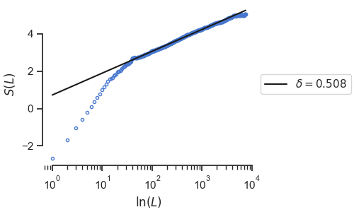

# Getting started

## Setting up

pymdea is [available on PyPI](https://pypi.org/project/pymdea) and can be installed with:

```bash
pip install pymdea
```

or can be installed from PyPI with [uv](https://docs.astral.sh/uv):

```bash
uv add pymdea
```

??? abstract "Building from source with uv"

    Install the [uv python project manager](https://docs.astral.sh/uv), following the instructions on uv's [official installation guide](https://docs.astral.sh/uv/getting-started/installation).

    Using a command line terminal, clone the pymdea repository to a location on your file system:

    ```txt
    git clone https://github.com/garland-culbreth/pymdea.git /example/file/path/pymdea.git
    ```

    Navigate to the cloned repository directory:

    ```txt
    cd /example/file/path/pymdea.git
    ```

    and run the uv command:

    ```txt
    uv sync
    ```

    This will create a python virtual environment in a subdirectory called `.../pymdea.git/.venv` which contains a python executable and all packages necessary to run pymdea. The command will display text output in the command line, which should look like this:

    ```txt
    ❯ uv sync
    Using Python 3.12.5
    Creating virtualenv at: .venv
    Resolved 107 packages in 1.01s
    Built pymdea @ file:///D:/repos/pymdea.git
    Prepared 101 packages in 819ms
    ░░░░░░░░░░░░░░░░░░░░ [0/101] Installing
    Installed 101 packages in 5.05s
    + asttokens==2.4.1
    + attrs==24.2.0
    + babel==2.16.0
    ... (all 101 packages uv installs will be listed out)
    ```

    Note: the file path, `D:/repos/pymdea.git`, is the directory on my own file system where my clone of pymdea is located.

    To confirm the files work properly, run the uv command:

    ```txt
    uv run pytest
    ```

    This runs the pymdea test suite from `test_core.py` and display a summary of the results in the command line output.

Once pymdea is installed, you're ready to import the pymdea.core and pymdea.plot modules and work with them!

## Loading pymdea

Import from the pymdea modules as you would any Python package.

```py
from pymdea.core import DeaEngine, DeaLoader
from pymdea.plot import DeaPlotter
```

## Loading data

The `pymdea.core` module provides a `DeaLoader` class with helper methods for wrangling data. It also has a `make_sample_data` method for generating sample data for testing purposes, which is what this notebook will use to illustrate an example workflow.

```py
dea_loader = DeaLoader()
dea_loader.make_sample_data(30000)
```

## Analyzing data

The `DeaEngine` class from `pymdea.core` contains the methods for analyzing data once it's been loaded. Pass `DeaLoader` to `DeaEngine` to pass the data from the loader to the engine, then invoke the `analyze` method to run an analysis.

```py
dea_engine = DeaEngine(dea_loader)
dea_engine.analyze_with_stripes(fit_start=0.1, fit_stop=0.9, stripes=60)
```

```txt
100% ━━━━━━━━━━━━━━━━━━━━━━━━━━━━━━━━━━━━━━━━ eta 0:00:00 elapsed 0:00:00

δ         μ (rule 1)   μ (rule 2)   μ (rule 3)
──────────────────────────────────────────────────
0.50781   1.50781      2.96924      1.49219
```

## Viewing results

The `DeaPlotter` class from `pymdea.plot` contains methods for viewing the results and producing plots. Pass `DeaEngine` to `DeaPlotter` to pass the results from the engine to the plotter, then invoke the plotting methods to view different summaries of the results.

```py
dea_plot = DeaPlotter(dea_engine)
```

The most illustrative figure is plotting the Shannon entropy against the log of the window lengths, S(L) vs ln(L):

```py
dea_plot.s_vs_l()
```



It's also useful to quickly compare the results of the different rules for computing the mu parameter:

```py
dea_plot.mu_candidates()
```


